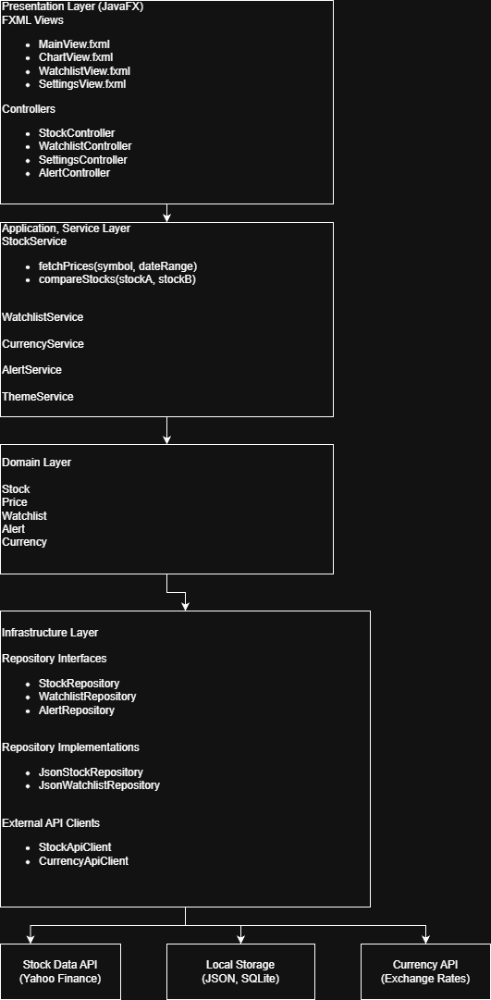

## Architecture Overview (Sprint 1)

The StockComparer application is designed using a simple, component-based architecture. 
The system separates concerns between the user interface, business logic, data retrieval, and data storage components. 
This separation improves maintainability and clarity while allowing each component to evolve independently.

The current architecture provides a foundation that can be incrementally developed into a Clean Architecture in later sprints. 
This approach supports scalability, modularity, and future extension of the system, including advanced comparison features and service-oriented components.

## System Architecture

