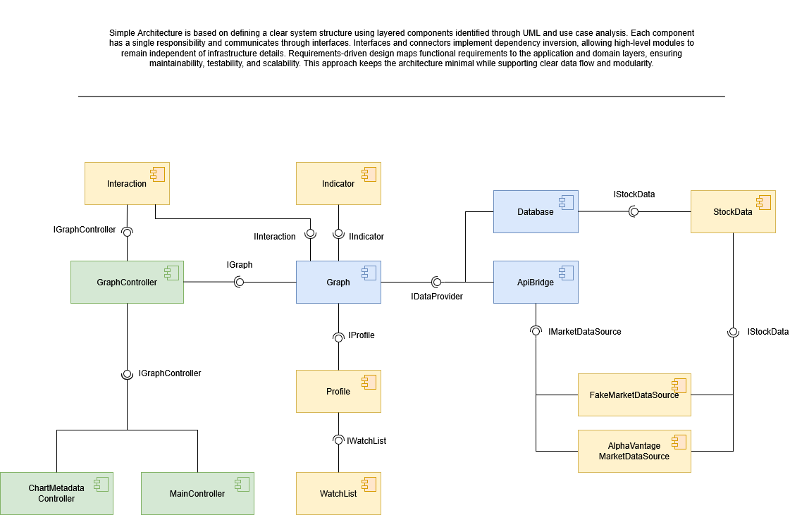

The StockComparer application is designed using a simple, component-based architecture. 
The system separates concerns between the user interface, business logic, data retrieval, and data storage components. 
This separation improves maintainability and clarity while allowing each component to evolve independently.

The current architecture provides a foundation that can be incrementally developed into a Clean Architecture in later sprints. 
This approach supports scalability, modularity, and future extension of the system, including advanced comparison features and owres.stockcomparer.model.data.Api.service-oriented components.

## Architecture (Sprint 1)
This project follows simple architectural principles.
Core responsibilities are separated into controllers (database, currency, chart metadata),
which are currently implemented as abstract components and will be extended in later sprints.

## Simple System Architecture

## System Diagram

## Initial System Architecture

## Meeting Records 

All meetings were conducted via Microsoft Teams.

08/02  19:30  Kickoff — project scope defined

16/02  20:30  Architecture — components & controllers agreed

22/02  21:30  Planning — identified missing parts

23/02  19:00  Design — diagrams refined, roles assigned

24/02  20:30  Review — progress checked, adjustments made

04/03  20:00  Implementation — data layer issues identified

15/03  21:00  Architecture — move toward Clean Architecture

15/04  19:30  Final review — structure validated, next steps set
